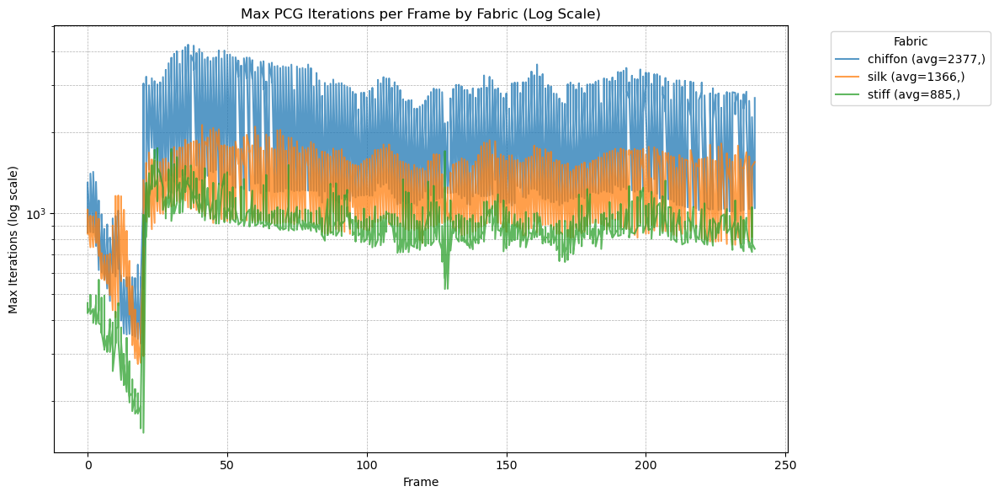
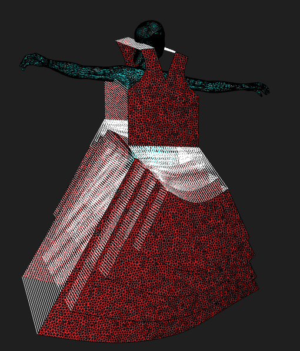
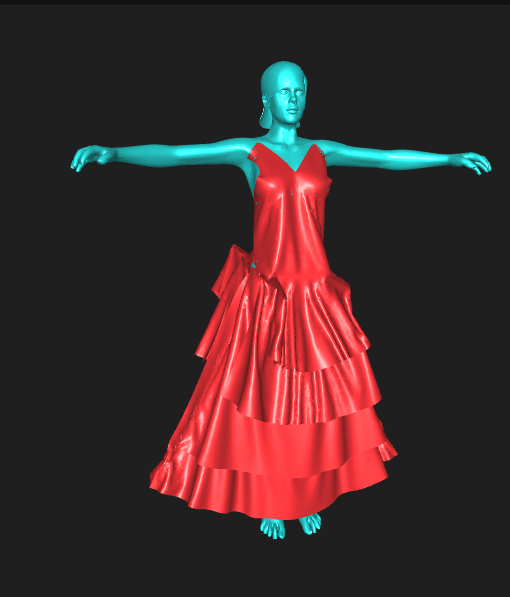
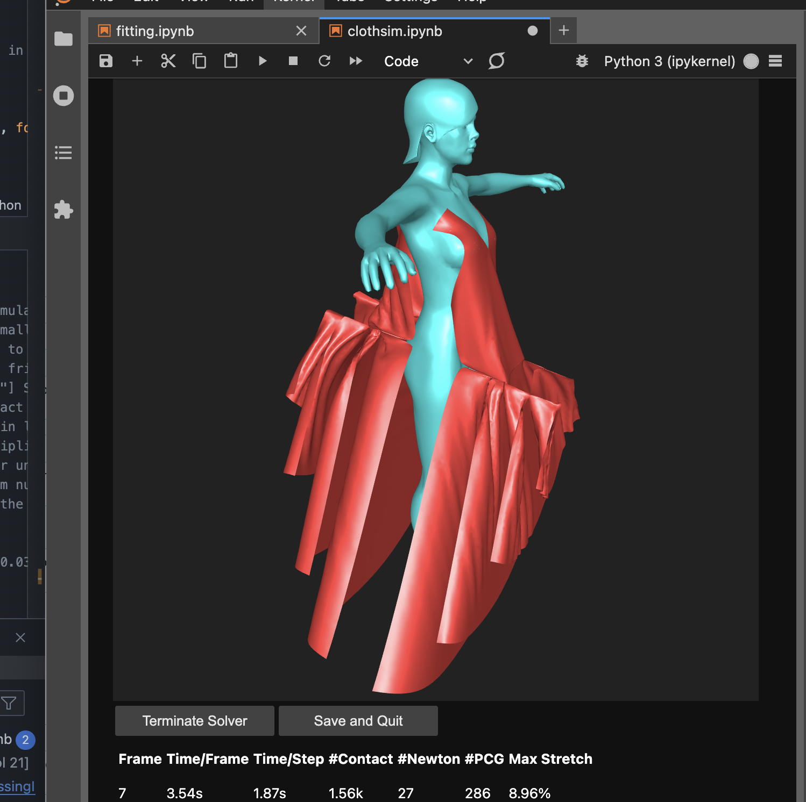
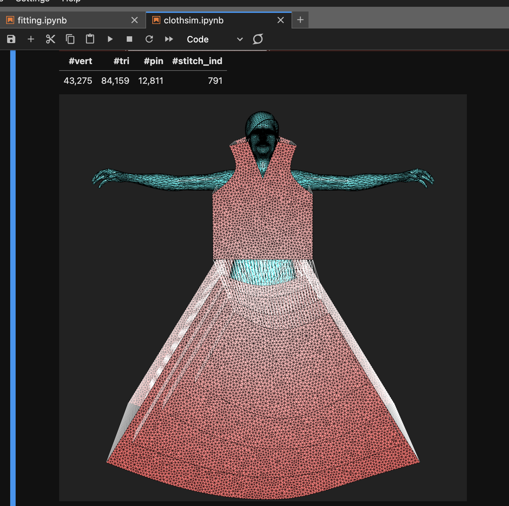

# PPFSimulationData: Cloth Simulation Stress Test — PCGM Benchmarking

This repository contains all the assets, logs, analysis scripts, and visualizations used in a research project exploring the performance of the **Conjugate Gradient Method (CGM)** under complex cloth simulation scenarios. The simulations were built using [PPF Contact Solver](https://github.com/st-tech/ppf-contact-solver), which implements a [linear system] (https://github.com/st-tech/ppf-contact-solver/blob/main/src/cpp/solver/solver.cu) that can be modified given that you have access to a NVDIA driver on your host machine. Otherwise, they provide a Docker container that can be deployed with cloud services, such as Vast.ai

## Simulation snippets:

